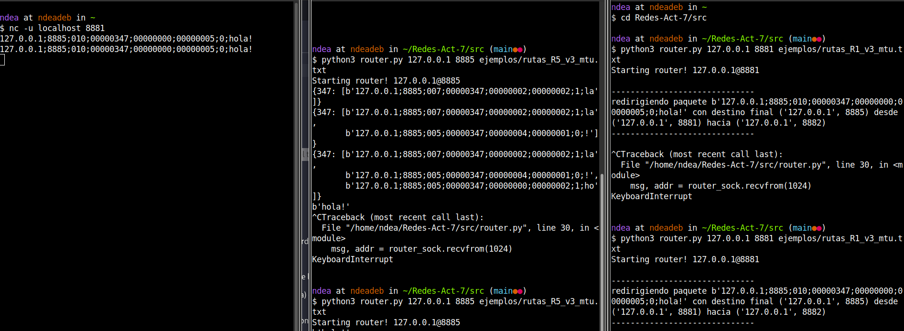
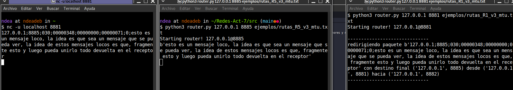

# Fragmentación

> Autor: Joaquin Lopez

## Codigo y Desiciones

En la carpeta [src](./src) esta todo el codigo, el cual se divide en
- [router.py](./src/router.py) -> para crear routers
- [utils.py](./src/utils.py) -> el cual tiene la funciones para los packets
- [test.py](./src/test.py) -> el cual tiene unos tests para ensamblar y reassamblear los packet
Los ejemplos usados estan en la carpeta [ejemplos](./src/ejemplos) y en el archivo [tests.txt](./src/tests.txt)

Como se recomendo, gran parte del codigo esta basado en la actividad pasada, lo que cambia ahora son
- los headers
- las funciones de fragmentacion y reensamble
- El router tiene la responsabilidad de ensamblar los mensajes que le llegan

Pequeñas decisiones de diseño:
- La funcion `fragment_IP_packet()` es una funcion recursiva, con caso base cuando el largo es `<= MTU`

## Tests

### Ejecucion
Para ejecutar el codigo, basta con crear los routers en cada consola (en la carpeta [src](./src/))
```sh
python3 router.py 127.0.0.1 8881 ejemplos/rutas_R1_v3_mtu.txt
python3 router.py 127.0.0.1 8882 ejemplos/rutas_R2_v3_mtu.txt 
python3 router.py 127.0.0.1 8883 ejemplos/rutas_R3_v3_mtu.txt 
python3 router.py 127.0.0.1 8884 ejemplos/rutas_R4_v3_mtu.txt
python3 router.py 127.0.0.1 8885 ejemplos/rutas_R5_v3_mtu.txt 
```
Y luego usar netcat con el router que queramos (en este caso usamos el R1)

```sh
nc -u localhost 8881
```

Ojo que, como esta diseñado el codigo, podemos usar netcat apretando enter nomas, sin usar EOF
(le saco el "\n" cuando recibo el mensaje)

Por lo tanto, basta con usar los packets que estan en [tests.txt](./src/tests.txt) y empezar a testear! ojo que tienen un ttl de 30, ahi queda a discrecion de ti si usas ttl menores y no se alcanza el router.

### Test 1

Iniciando los routers, y usando el mensaje:
```txt
127.0.0.1;8885;010;00000347;00000000;00000005;0;hola!
``` 
Podemos ver que, debido al ttl bajo, aveces llega al R5, pero si lo enviamos denuevo (recuerden cambiar el id), hay veces que algunos fragmentos se mueren por el ttl.
Pero el mensaje se re-ensambla bien



El de al medio es el router 5, la derecha el router 1 y la izquierda netcat

### Test 2
Ahora vamos a enviar el siguiente mensaje del router 1 al 5 el siguiente mensaje
```txt
127.0.0.1;8885;030;00000348;00000000;00000071;0;esto es un mensaje loco, la idea es que sea un mensaje que se pueda ver, la idea de estos mensajes locos es que, fragmente esto y luego pueda unirlo todo devuelta en el receptor
```

Si usamos un ttl suficientemente grande(en este caso 30), podemos ver que el mensaje va a llegar a R5 y va printear todo el mensaje, notar que el largo de ese mensaje es > 255 (con headers incluidos)



Respondiendo a las otras preguntas, **Sí**, el codigo fragmenta en fragmentos mas pequeños de ser necesario, esto lo podemos ver cuando en la ejecucion, el R1 envia al R2 y del R2 al R3 como MTU es mas pequeño, termina enviando fragmentos de tamaño 2 a R3 de lo ya fragmentado (ver la ejecucion de los routers) y el comportamiento no cambia mucho si usamos un ttl fijo suficientemente grande, digase 30, lo que cambia es la cantidad de veces que se fragmenta packet ahora es menor, pero siguen llegando los mensajes al router, en el archivo [tests.txt](./src/tests.txt) hay ejemplos para otros routers.